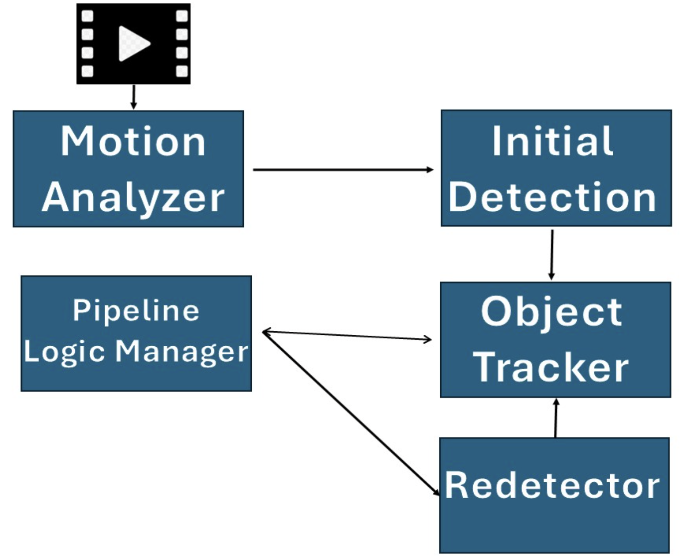
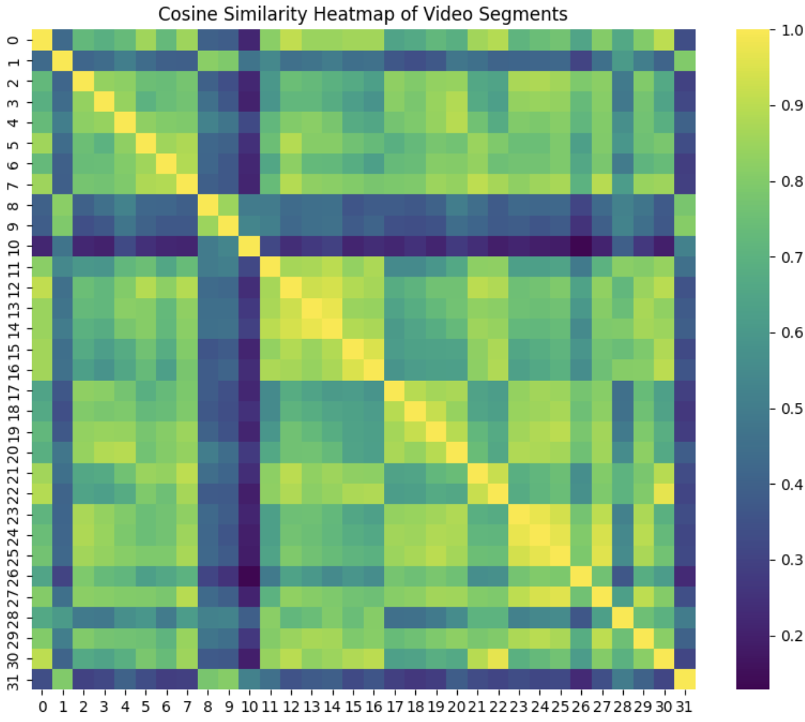
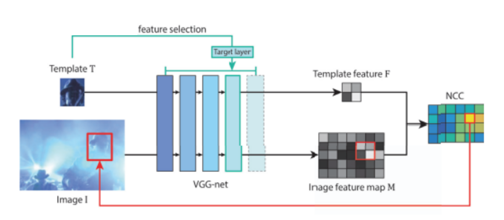
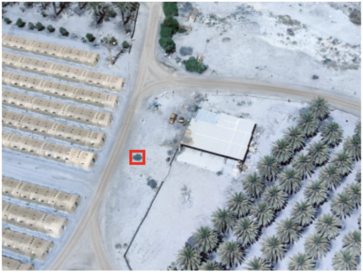

# Drone Footage Object Tracking And redetection

An object tracking system designed for drone footage and challenging scenarios where objects may leave and re-enter the frame. The system combines CSRT tracking with VGG16-based redetection and intelligent motion analysis to maintain robust tracking performance.




## Challanges

Track a target object (identified in the first frame) throughout a video sequence with the following challenges:
- **Frame exit/re-entry**: Object may temporarily leave the frame
- **Motion segmentation**: Drone footage requires identifying still segments for reliable redetection
- **Drift prevention**: Long-term tracking without accumulating errors
- **Scale/rotation variance**: Object appearance changes across frames

##  Key features of the system

- **Hybrid Tracking**: CSRT tracker for frame-to-frame tracking with VGG16 deep feature-based redetection
- **Motion-Aware Segmentation**: Automatic detection of still camera segments using optical flow
- **Scene Similarity Matching**: DINOv2-based scene similarity to determine optimal redetection segments
- **Template Management**: Multi-scale and multi-rotation template bank with drift detection


##  Modules

### 1. Motion Analyzer

**Purpose**: Preprocess video to identify segments and compute segments similarity.

**Key Functions**:
- **Optical Flow Analysis**: Computes frame-by-frame motion magnitude using Lucas - Kandle optical flow
- **Scene Embedding**: Extracts DINOv2 features from representative frames in each segment
- **Similarity Matrix**: Computes cosine similarity between segments to find matching scenes





**Technical Details**:
- Uses downsampled frames (0.1x) for efficient optical flow computation
- DINOv2-base model for robust scene representation
- Caches results to disk for faster subsequent runs


### 2. ROI Selector (ObjectEmbedder)

**Purpose**: Initialize tracking by selecting the target object in the first frame.

**Modes**:
- **Manual Mode**: Interactive ROI selection via OpenCV's 
- **Automatic Mode**: Pre-defined bounding boxes from config

**Future Work :**
- **Automatic mode**: Self Detecter using attention based methods

### 3. Object Tracker (CSRT)

**Purpose**: Frame-to-frame tracking using OpenCV's CSRT (Discriminative Correlation Filter with Channel and Spatial Reliability).

**Why CSRT?**
-  Handles partial occlusions
-  Interpretable tool
-  Robust to scale changes
-  High accuracy on benchmarks
-  Easy to manipulate confidence 


### 4. VGG Redetector

**Purpose**: Relocate lost objects using deep feature matching with multi-scale and multi-rotation search.

**Architecture**:




**How It Works**:

1. **Template Extraction**: Extract VGG features from initial ROI at multiple scales and rotations
2. **Template Bank**: Store feature maps for each scale/rotation combination
3. **Template Bank Update**: Update the Template Bank every n second with currect template
3. **Search**: For each template, perform spatial convolution over search frame features
4. **Peak Detection**: Find highest correlation peak with PSR confidence scoring
5. **Best Match**: Return bbox from template with highest PSR across all scales/rotations





**Matching Methods**:
- **NCC (Normalized Cross-Correlation)**: Default, robust to illumination changes
- **Cosine Similarity**: Alternative, faster but less robust

**Configuration**:
```python
'redetector': {
    'device': 'cpu',                      # 'cuda' or 'cpu'
    'vgg_layer': 30,                      # VGG layer (30=conv5_3, 23=conv4_3) Suprisingly Conv5 was a lot better than earlier layers
    'stride': 16,                         # Feature map stride
    'confidence_threshold': 12,           # Minimum PSR for valid detection
    'scales': [0.3, 0.5, 0.8, 1.0, 1.5], # Multi-scale search
    'rotation_angles': [0, 90, 180, 270], # Multi-rotation search
    'method': 'ncc',                      # 'ncc' or 'cosine'
}
```
PSR = (peak_value - mean) / std


### 5. Tracking Manager (Pipeline)

**Purpose**: Orchestrate all modules and implement intelligent tracking/redetection logic.

**Pipeline Flow**:

```
┌─────────────────┐
│  Load Video     │
│  Analyze Motion │ ← Motion Analyzer
│  Select ROI     │ ← ROI Selector
└────────┬────────┘
         │
    ┌────▼─────────────────────────────────┐
    │  For each frame:                     │
    │                                      │
    │  1. CSRT Tracking                    │ ← Tracker
    │     ├─ Success? ─────────────┐       │
    │     │                         │       │
    │     ▼ YES                    ▼ NO    │
    │  2. Check Drift           3. Lost    │
    │     │                        │        │
    │     ├─ Template Update       │        │
    │     │  (periodic)            │        │
    │     │                        │        │
    │     ├─ Drift Detection       │        │
    │     │  (cosine similarity)   │        │
    │     │                        │        │
    │     │                    ▼           │
    │     │              4. Redetection    │ ← VGG Redetector
    │     │                 (if still      │
    │     │                  segment +     │
    │     │                  scene match)  │
    │     │                        │        │
    │     │                        ├─ Use combined templates
    │     │                        │  (current + original)
    │     │                        │        │
    │     │                    ▼           │
    │     │              5. Reinitialize   │
    │     │                 CSRT tracker   │
    │     └────────────────────┬───────────┘
    │                          │
    └──────────────────────────┘
```

**Key Mechanisms**:

**Drift Detection**:
- Periodically compare current tracked region with original template
- If cosine similarity < threshold (0.6), trigger redetection
- Prevents long-term drift accumulation

**Intelligent Redetection**:
- Only attempt when:
  - In still segment (motion < threshold)
  - Scene similarity with initial frame > 0.6
- Uses combined template bank (current + original)


**Minimum Bbox Enforcement**:
- Prevents tracker from degrading on tiny bounding boxes
- Expands bbox to minimum size (50×50) while preserving center

**Configuration**:
```python
'pipeline': {
    'visualize_size': 0.3,                        # Display resize factor
    'min_cosine_similarity_for_update': 0.6,      # Scene similarity threshold
    'lost_frame_redetect_threshold': 30,          # Frames before redetection
    'template_update_interval': 90,               # Frames between updates
    'cosine_similarity_drift_threshold': 0.6,     # Drift detection threshold
    'input_resize_factor': 0.5,                   # Input video resize (0.5 for 4K)
    'min_bbox_size': 50,                          # Minimum bbox dimension (pixels)
}
```

---


### Basic Usage

1. **Prepare your video**:
   - Place video in `data/input/`
   - Supported formats: `.mp4`, `.avi`, `.mov`

2. **Configure tracking**:
   Edit `modules/config.py` to set ROI and parameters.

3. **Run tracker**:
```
python run_tracker.py
```


---

##  Configuration

All parameters are centralized in `modules/config.py`


##  Project Structure

```
object-tracker/
├── modules/
│   ├── __init__.py
│   ├── config.py              # Configuration parameters
│   ├── motion_analyzer.py     # Motion analysis & segmentation
│   ├── roi_selector.py        # ROI selection
│   ├── tracker.py             # CSRT tracker wrapper
│   └── vgg_detector.py        # VGG redetection
├── data/
│   ├── input/                 # Input videos
│   └── output/                # Tracked videos
├── cache/                     # Cached motion/features
├── docs/
│   └── images/                # Documentation images
├── pipeline.py                # Main tracking pipeline
├── run_tracker.py             # Entry point script
├── requirements.txt
└── README.md
```


##  Based on:

- **OpenCV CSRT Tracker**: Lukezic et al., "Discriminative Correlation Filter with Channel and Spatial Reliability"
- **VGG16**: Simonyan & Zisserman, "Very Deep Convolutional Networks for Large-Scale Image Recognition"
- **DINOv2**: Meta AI Research, "DINOv2: Learning Robust Visual Features without Supervision"

## Limitations:

- The system find it hard to detect and update very small objects.
- Fine Tuning VGG on drone footage can help 


